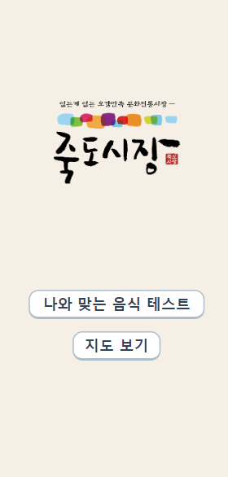
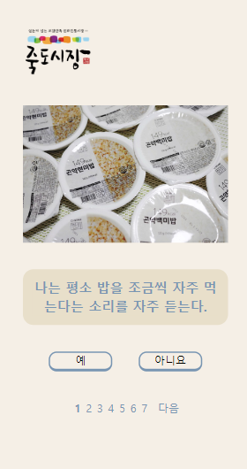
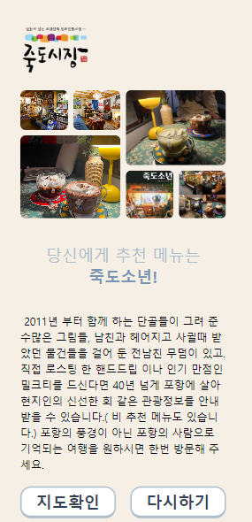

# 죽도시장 프로젝트

> 사용한 개발 도구  
>         

### 개발 기간

> 2023-5-24 ~ 2023-5-25 (2일)  
> 링크: https://master--ornate-centaur-aae239.netlify.app

역할
|이름|역할|
|---|---|
|이현진|PM|
|정시온|기획|
|김수환|리드 디벨롭|
|김현우|서브 디벨롭|
|이경록|서브 디벨롭|
|제환웅|서브 디벨롭|

### 페이지

1. 메인 페이지  
   
2. 퀴즈 페이지  
   
3. 결과 페이지  
   
